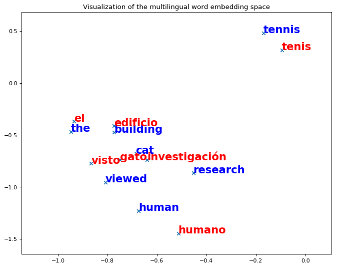

# Running the code

Run the python notebook - unsupervised.ipynb

# Before Training

After Training for 500000 epochs we got 13056 word pairs.
Refining it further using Procrustes, the mapping improved and 14427 word pairs were generated. The mean cosine is 0.7254.
# After Training

